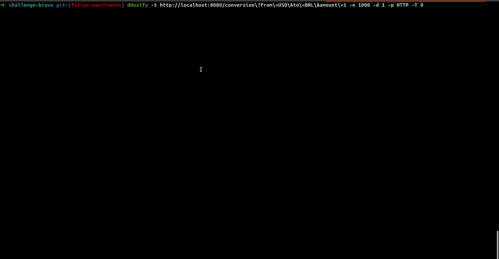

Your name: Felipe de Paula do Nascimento
Your Github homepage: https://github.com/felipepnascimento
Original challenge URL: https://github.com/hurbcom/challenge-bravo/pulls/ID_DO_PR

## 1. Running the application
Prefer docker to run this app

1. Run `docker-compose up --build` in the main folder of this app
2. See `challenge_bravo_flp_app` and `challenge_bravo_flp_db` running in your local docker.

## 2. Running the tests

1. Run `docker-compose exec app bash`
2. Run `make test` and see the results

## 3. Running stress tests

I choose the [Ddosify - High-performance load testing tool](https://github.com/ddosify/ddosify) to make the stress tests.

For run the test locally, you must be running the application by Step 1.

And [install](https://github.com/ddosify/ddosify#installation) ddosify by official documentation. See for [Macbook](https://github.com/ddosify/ddosify#homebrew-tap-macos-and-linux) or [Linux](https://github.com/ddosify/ddosify#apk-deb-rpm-arch-linux-freebsd-packages).

And then, run:

```bash
ddosify -t http://localhost:8080/conversion?from=USD&to=BRL&amount=1 -n 1000 -d 1 -p HTTP -T 0
```

> Note: In my tests, i get 100% of a 1000 requests in 1s, but, the exchange API returns internal server error sometimes. If you run the stress code many times, you will see the same results as mine. I think if was in production, maybe we use some premium service with zero downtime.

<p align="center">
  
</p>

## 4. API documentation
For this, see [that](TODO-swagger)

# TODOS
- Fazer um if para buscar pela API ou não (DIFICIL)
    - codar o bypass, quando a moeda não existir na API de conversão, baseado no exchange_api
- Colocar um linter no projeto
- Colocar o swagger na API
- Colocar um CI no github
- tentar expor o test coverage (opcional)
