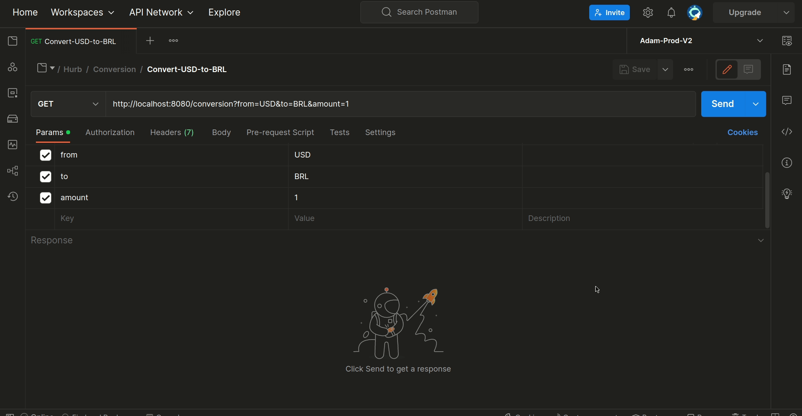

Felipe de Paula do Nascimento

https://github.com/felipepnascimento

https://github.com/hurbcom/challenge-bravo

Table of Contents
-----------------
- [Table of Contents](#table-of-contents)
- [Requirements](#requirements)
- [Installation](#installation)
  * [Running the application](#running-the-application)
  * [Running the tests](#running-the-tests)
  * [Running stress tests](#running-stress-tests)
- [Using the API](#using-the-api)
  * [Examples](#examples)
    + [Convert USD to BRL](#convert-usd-to-brl)
    + [Create new currency](#create-new-currency)

Requirements
-----------------
- Docker
- Docker Compose
- An API platform or cli to make http requests

Installation
-----------------
### Running the application
First things first, clone the `sample.env` file to `.env` file to setup env vars, and then run the commands bellow:

1. Run `docker-compose up --build` in the main folder of this app
2. See `challenge_bravo_flp_app` and `challenge_bravo_flp_db` running in your local docker and at http://localhost:8080

### Running the tests
1. Run `docker-compose exec app bash`
2. Run `make test` and see the results
> Or run `make test` local if you running your postgres locally

### Running stress tests

I choose the [Ddosify - High-performance load testing tool](https://github.com/ddosify/ddosify) to make the stress tests.

For run the test locally, [install](https://github.com/ddosify/ddosify#installation) ddosify by official documentation. See for [Macbook](https://github.com/ddosify/ddosify#homebrew-tap-macos-and-linux) or [Linux](https://github.com/ddosify/ddosify#apk-deb-rpm-arch-linux-freebsd-packages). Make sure this application is running on port `:8080`

And then, run:

```bash
ddosify -t http://localhost:8080/conversion?from=USD&to=BRL&amount=1 -n 1000 -d 1 -p HTTP -T 0
```

> Note: In my tests, i get 100% of a 1000 requests in 1s, but sometimes, the exchange API returns internal server error. If you run the stress code many times, you will see the same results as mine, success results. I think if it was in production, maybe we use some premium service with zero downtime.

<p align="center">
  
</p>

Using the API
-----------------

This API was seeded with some example data, see [Currency Seed](./migrations/seeds/currency.go) for more details.

> Available currency conversions: _USD, BRL, EUR, BTC, ETH and HURB_

> IMPORTANT: I don't create any kind of authentication is this API, it is public. But a think in production I'll make a `basic authentication`, `JWT authentication` or `OAuth`.

### Examples
<p align="center">
  
</p>

#### Convert USD to BRL
_Converts 25 dollars to reais_

> GET: /conversion?from=USD&to=BRL&amount=25

Parameters:
|    Name    |    Type    |    Required    |    Description    |
|    ----    |    ----    |    --------    |    -----------    |
|    from    |    string  |    true        |    Source currency to makes the conversion   |
|    to      |    string  |    true        |    Targets currency to makes the conversion   |
|    amount  |    float   |    true        |    Amount value to makes the conversion|

Responses:
|    Code    |    Description    |
|    ----    |    -----------    |
|    200     |    Success     |
|    400     |    Bad Request    |
|    500     |    Internal Server error    |

Responses examples JSON
> 200 - Success

```JSON
{
    "id": 0,
    "from": "USD", //from currency passed
    "to": "BRL", //to currency passed
    "amount": 25, // 25 dollars
    "result": 129.65146, // 25 dollars in reais
    "createdAt": "0001-01-01T00:00:00Z"
}
```

> 400 - Bad request

```JSON
// request without from parameter
{
    "Bad Request": "From parameter is required"
}

// request without to parameter
{
    "Bad Request": "To parameter is required"
}

// request without amount parameter
{
    "Bad Request": "Amount parameter is required"
}
```

> 500 - Internal server error

```JSON
{
    "Internal Server Error": "Some generic error"
}
```

#### Create new currency
_Create YER currency_

> POST: /currency

Parameters:
|    Name    |    Type    |    Required    |    Description    |
|    ----    |    ----    |    --------    |    -----------    |
|    key     |    string  |    true        |    Unique key to identify your currency   |
| description|    string  |    true        |    Some description to explain your currency   |
| exchangeApi|    bool    |    true       |     Note: if you pass a `false` value, you must informe too `customCurrency` and `customAmount` |
| customCurrency |    string  |   false    |    required when exchangeApi is `false`. A valid fiat currency to indicates value your custom currency coin. Ex: "BRL"   |
| customAmount   |    float  |    false    |    required when exchangeApi is `false`. An amount of `customCurrency` Ex: 99.0 of "BRL"   |

Responses:
|    Code    |    Description    |
|    ----    |    -----------    |
|    200     |    Success     |
|    400     |    Bad Request    |
|    500     |    Internal Server error    |

Request examples JSON

> Simple creation
```JSON
{
    "key": "YER",
    "description": "YER desc",
    "exchangeApi": true
}
```

> Custom creation
```JSON
{
    "key": "HURB",
    "description": "HURB desc",
    "exchangeApi": false,
    "customAmount": 99,
    "customCurrency": "BRL",
}
```

Responses examples JSON
> 200 - Success

```JSON
{
    "id": 0,
    "key": "YER",
    "description": "YER desc",
    "exchangeApi": true,
    "customAmount": 0,
    "customCurrency": "",
    "createdAt": "0001-01-01T00:00:00Z"
}

```

> 400 - Bad request

```JSON
// request without body
{
    "error": "EOF"
}
```

> 500 - Internal server error

```JSON
// request without key or description
{
    "error": "key and description cannot be empty"
}

// request with exchangeApi: false
{
    "error": "for custom currencies, CustomCurrency and CustomAmount cannot be empty"
}
```

See [API documentation](./docs/api.md) for more details.