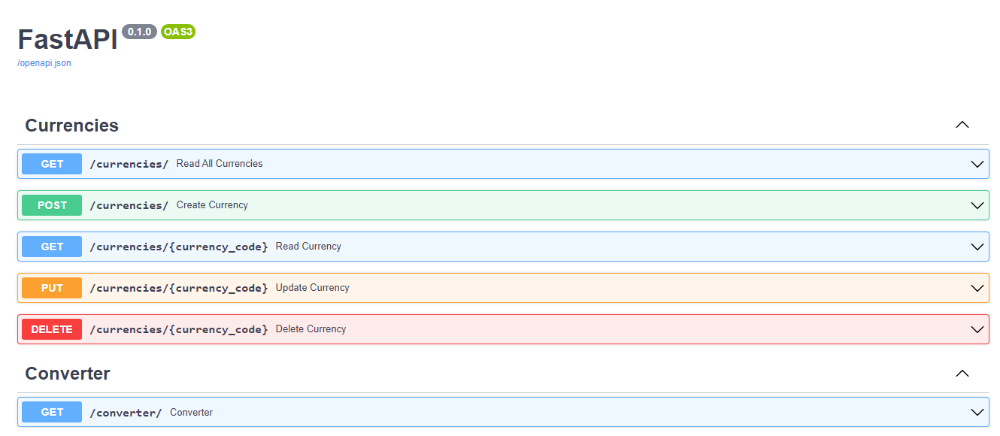

# Challenge Bravo

## Problema:
Na descrição do challenge-bravo, as instruções apontavam a necessidade de criar uma API retornando JSON para um CRUD de moedas: reais e irreais.
O desafio estava em encontrar estes dados sem delay e a melhor ferramenta encontrada, ao meu ver, foi a API gratuita da coinbase para tal.

## Solução proposta:
Utilizando a arquitetura padrão de boas práticas do fastAPI(routers/schemas/config...), criei 2 approaches bastante semelhantes para lidar com MOEDAS e suas respectivas CONVERSÕES(currencies/converter). Separei os routers, models, schemas e services. Para o GET das moedas, request para coinbase e tratamento dos dados para leitura, utilizando requisições a cada 5 minutos para que a API atualize nossa base de dados com as cotações para realizarmos conversões e o CRUD das moedas especificamente. Utilizei Alembic para as migrations, pytest para os testes, docker para containerização, Postgres para banco de dados e fastAPI baseada na arquiteutra que ja utilizo atualmente no projeto que atuo. Ao fim inseri async, suportada pelo FastAPI e linters como black e isort.

## Trade-offs e melhorias:
Alguns pontos de melhoria que eu atuaria se tivesse mais tempo:

 - Banco de dados em cache
 - Aumentos nos testes unitários par cobrir 100%
 - Inserção de testes de integração
 - Testes de carga
 - Mongodb no banco de dados


## Como rodar a aplicação
### Requisitos para execução:
1. Docker/docker-compose
2. Renomeie o arquivo ".env.example" para ".env"

### Passos para execução:
1.   `git clone https://github.com/mirosadev/challenge-bravo`
2.  `cd challenge-bravo`
3.  `docker-compose up --build`


## Testes
Foram criados testes unitários cobrindo todos endpoints da aplicação, converter e currencies.

Para executa-los utilize no terminal, na raíz do projeto:
###  Testes unitários
```bash
docker compose run --service-ports -e --rm api bash -c "pytest ${test} --disable-warnings
```

## Endpoints

A documentação extensa de todo tipo de input e output pode ser encontrada em https://localhost/8000/docs conforme indicação de como executar a aplicação.

