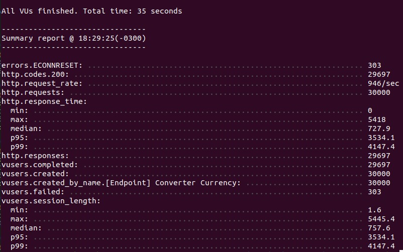
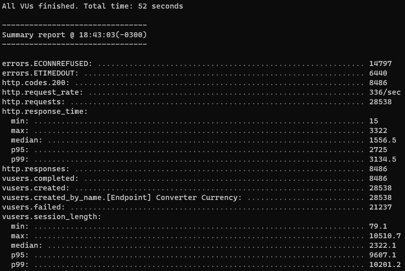

#  Bravo Challenge - Currency Converter API

### Tecnologias utilizadas

- NodeJS - 14.20.1
- Express
- Mongoose
- Jest
- MongoDB - latest
- Docker - 20.10.21
- Docker Compose - 2.12.2
- Redis

Não foi utilizado nenhum framework de boilerplate, a API foi escrita do 0 utilizando `npm init`

### Como rodar o projeto

É necessário ter instalado as seguintes ferramentas

| Tool           | Version  |
| -------------- | -------- |
| Docker         | 20.10.21 |
| Docker Compose | 2.12.2   |

Para instalar as dependências, subir o docker e iniciar o projeto, basta o único comando abaixo

```sh
docker compose up --build
```

O projeto estará rodando em:

```sh
localhost:3000
```

E a documentação da API está disponível em:

```sh
localhost:3000/api-docs
```

### Utilizando a API

A API foi desenvolvida para realizar conversões entre as seguintes moedas

- BRL
- USD
- EUR
- BTC
- ETH

E tendo como base o USD para realizar as conversões. Todas elas podem ser convertidas entre si.

Você também pode adicionar novas moedas para serem convertidas dentre as demais. Atente-se que ao cadastrar uma nova moeda, você deve informar o valor dela com **base em USD**

Nela você consegue

- Fazer a Conversão
- Cadastrar
- Listar
- Atualizar
- Remover

# Teste de Carga

### Executando

Para os testes de carga da API, foi utilizada a ferramenta **Artillery**.
Caso deseje realizar este teste na sua maquina, é necessário instalar a ferramenta de forma global

```sh
npm i -g artillery
```

Em seguida, execute o comando (na raiz do projeto)

```sh
artillery run convert-currency.yml
```

É necessário que a API esteja em execução

Você pode abrir o arquivo `convert-currency.yml` e alterar as propriedades do teste, que são:

- duration - duração do teste em ms
- arrivalRate - quantidade de requisições simuladas por segundo

### Resultados

Foram realizados dois testes, numa máquina Linux com Ubuntu e um Windows 11

Abaixo é o resultado rodando no Ubuntu com as seguintes especificações

- Ubuntu 20.04.5 LT
- Intel Core i7 10610U 1.8Ghz 8x
- 16GB RAM

<p align="center">
  
</p>

Abaixo é o resultado rodando no Windows 11 com as seguintes especificações

- Windows 11
- Intel Core i5-8250U CPU @ 1.60GHz - 1.80 GHz
- 8GB RAM

<p align="center">
  
</p>

#### Conclusão dos testes

Conclui-se que a API estando deployada num bom servidor Linux (ElasticBeanstalk), suporta até mais que 1000 requisições por segundo.

Isso se da pela escolha de manter os dados das cotações em cache com o Redis
