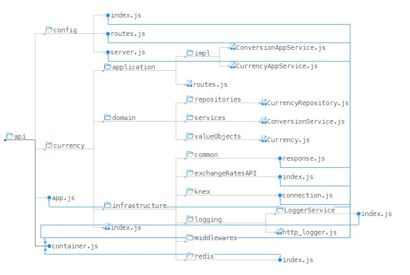

# ARCHITECTURE

Ao planejar o projeto, levei em consideração o tempo máximo que havia para desenvolver o mesmo e a complexidade do mesmo.

O tempo máximo era extremamente alto, portanto eu tinha uma liberdade para escolher arquiteturas que necessitam de um maior gasto de tempo nesse quesito (Visto que a maioria dos desafios são um pouco mais complexos e têm prazo médio de 2 dias).

A complexidade do projeto era baixa, portanto a maioria das arquiteturas também se adaptaria.

Portanto, optei por uma arquitetura que fornecesse uma melhor visão em relação ao negócio e que também pudesse fazer com que o serviço escalasse, para adicionar features a mais relacionadas ao contexto, facilitar uma futura integração com microserviços e etc.

Portanto, escolhi realizar a implementação de uma arquitetura próxima à Onion. A arquitetura Onion é conhecida por ser uma arquitetura bem clean, por promover os conceitos principais do SOLID e também desacoplar as camadas. Basicamente, temos diversas camadas onde a interna (Domain) é a mais crítica e é a mais próxima do negócio. A domain está conectada com a camada Application, e todo o conteúdo externo (Por exemplo, os itens da Infrastructure) são abstraídos para permitir uma rápida mudança. Assim, a troca de um banco de dados (por exemplo) se torna simples, pois há uma classe-interface que interliga o domain com o banco de dados. O mesmo para testes e a View (que no caso, nesta aplicação não temos).

Essa implementação também se relaciona bem com o modelo de DDD, para caso fosse interessante a adoção para o hurb.

Visto o porte da hurb, a mesma demanda uma maior escalabilidade em suas aplicações, e creio que a arquitetura Onion seja perfeita para este quesito.

Um ponto negativo da Onion é o tempo de implementação. A construção inicial da arquitetura demanda um pouco de atenção e tempo, para evitar códigos "macarrônicos. Isto pode ser um desafio para pessoas que estão iniciando na área. Todavia, a arquitetura Onion, por ser fortemente embasada no uso de IoC, facilita para que os iniciantes não realizem a criação de códigos muito acoplados.

---

-   [Overview](./CHALLENGE.md)
-   [Sobre as tecnologias](./TECHS.md)

[Retornar ao README](../README.md)
